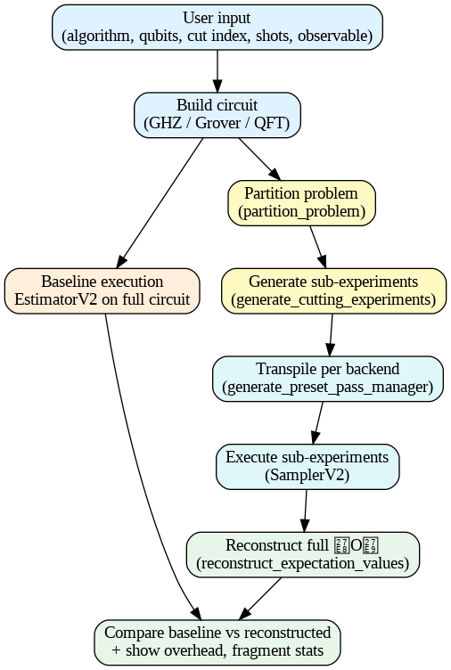

# Distributed Quantum Circuit Cutting

An interactive **Streamlit** web application that demonstrates **distributed quantum computing** via **circuit cutting** using Qiskit’s [`qiskit-addon-cutting`](https://qiskit.org/ecosystem/cutting/) module.

The app allows you to:
- Build small quantum algorithms (**GHZ**, **Grover**, **QFT**)
- Select a **partition** (A|B) to simulate running on multiple QPUs
- Compare **baseline** (uncut) execution vs **distributed (cut)** execution
- View **sampling overhead**, **fragment stats**, and **reconstructed expectation values**

---
## 🔄 Flow Chart

<p align="center">
  
</p>

## 📸 Features
- **Algorithm selection**: GHZ state, Quantum Fourier Transform, Grover’s search
- **Customizable partition**: Choose where to cut the circuit between two “QPUs”
- **Observable configuration**: Single or multiple Pauli strings (e.g., `ZZZZ`, `IIZZ`)
- **Simulator control**: Toggle noiseless Aer backend or noisy simulation
- **Metrics**: Depth, size, two-qubit gate count, sampling overhead
- **Visualization**: ASCII circuit diagram + QASM3 code

---

## 🛠 Requirements

Install dependencies from `requirements.txt`:

```bash
pip install -r requirements.txt
